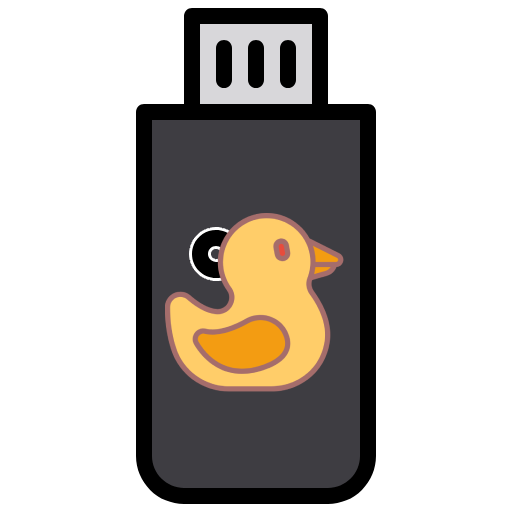
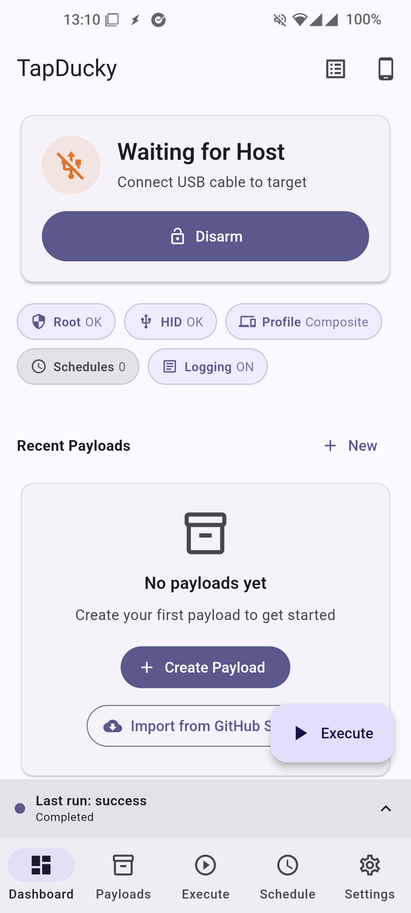
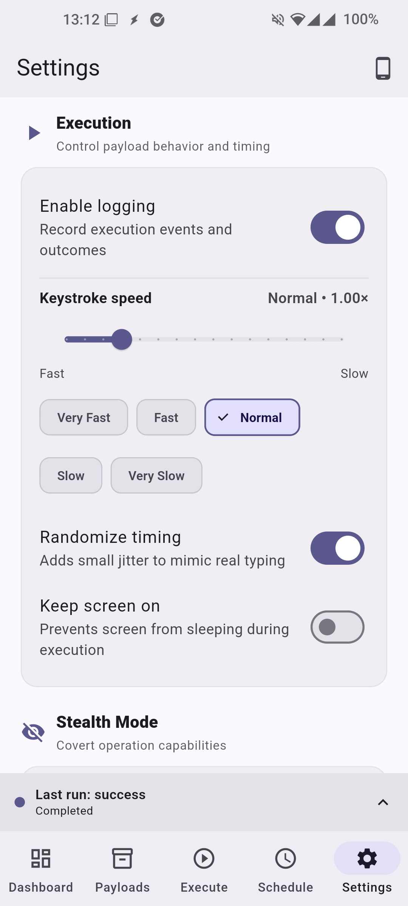
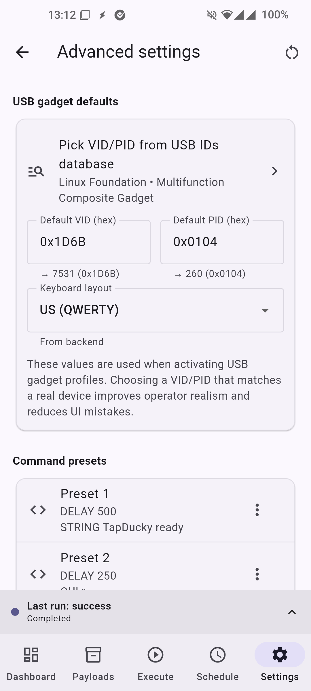
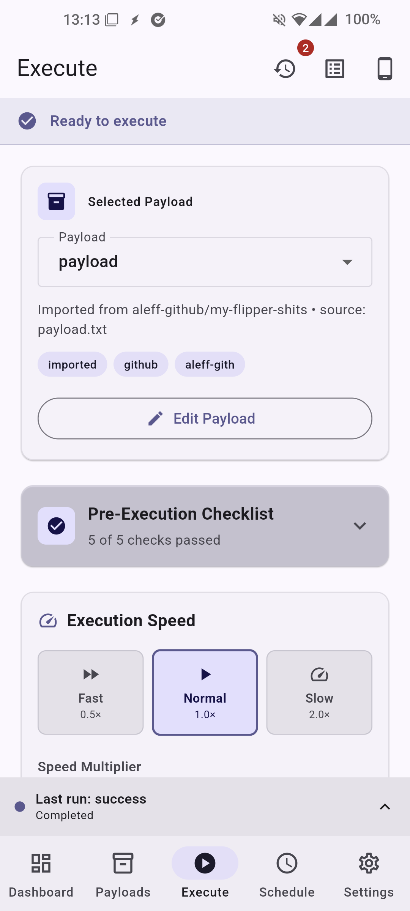
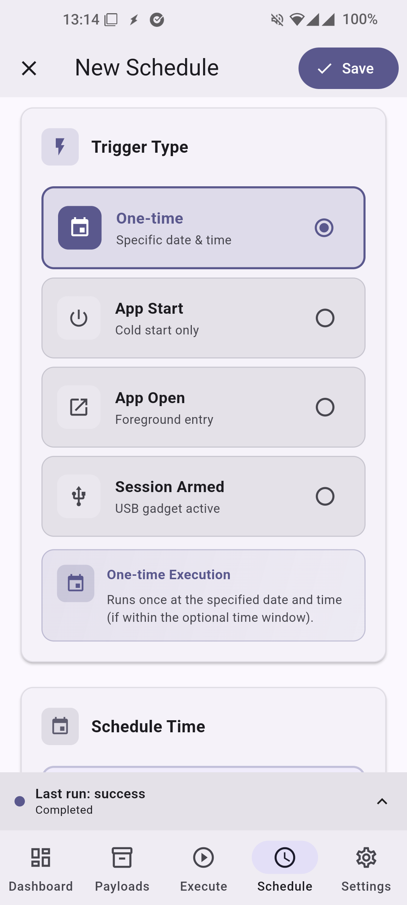
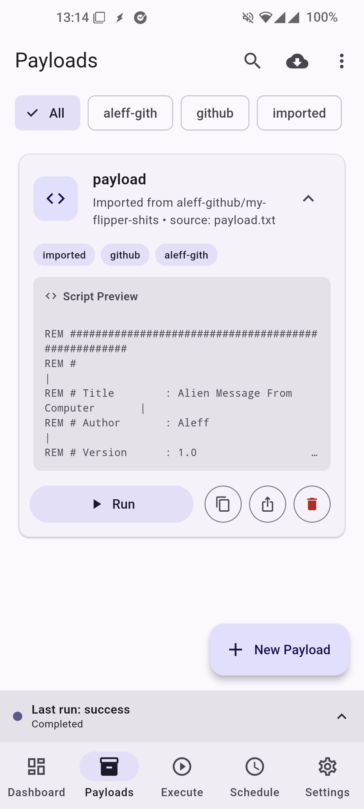
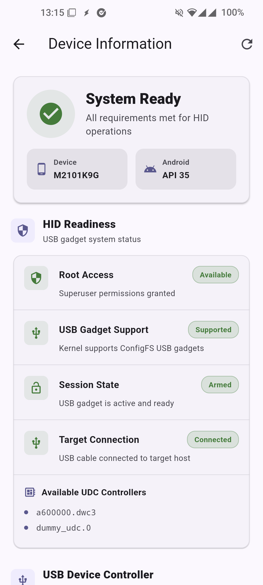
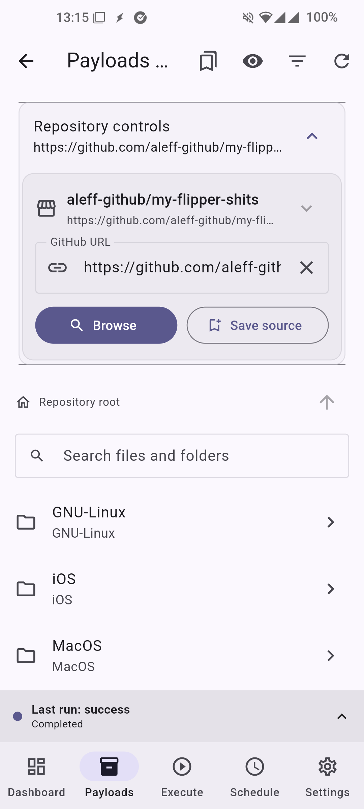
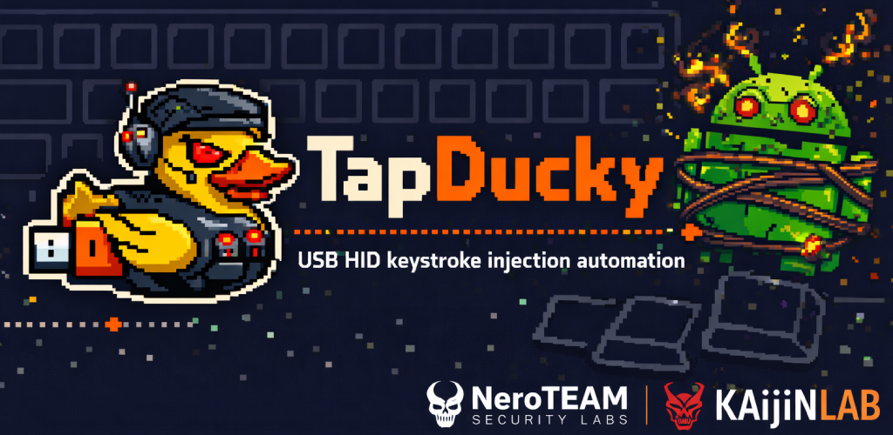

# TapDucky - Android USB HID Keystroke Injector

<h3 style="font-size: 2.2rem; letter-spacing: 1px;">TapDucky - Android USB HID Keystroke Injector</h3>

 <strong>Open-source DuckyScript runner for rooted Android with USB Gadget (ConfigFS) support</strong>  <strong>TapDucky</strong> lets you create, customize, schedule, and run DuckyScript on Android by emulating a USB keyboard, mouse, or composite HID device for authorized testing and automation. It includes payload parameterization, multiple scheduler triggers, execution logs, and a GitHub-backed payload library with automatic DuckyScript validation and optional Digispark <code>.ino</code> conversion. 

  
  
  
  
  

  

    
  

## Overview

- USB HID gadget profiles (no external USB dongle required on supported/rooted devices):
  - Keyboard, Mouse, and Composite profiles with configurable VID/PID, manufacturer/product strings, and power draw.
- DuckyScript pipeline:
  - Live validation with human‑readable issues/warnings, placeholder parameters, delay multiplier, and optional jitter for human‑like timing.
- Payload management:
  - Create/edit payloads with name/description/tags/parameters, quick share/export, and built‑in templates/wizard.
- GitHub Payload Store:
  - Add sources, browse repositories, preview files with validation, import supported scripts; auto‑detects DuckyScript and converts Digispark `.ino` sketches when possible.
- Scheduler:
  - One‑time at date/time, on App cold start, on App foreground, or when HID session is armed (device_connected), with optional daily time window.
- Execution & Logs:
  - Tabbed execute view, parameter prompts, run/cancel, execution history, and structured logs with export/clear and level filter.
- Device diagnostics:
  - Snapshot of device, kernel/gadget status, UDC info, keyboard layouts; copy‑to‑clipboard; emulator detection note.

Note: A rooted device with Linux USB gadget (ConfigFS) support is required. Use a physical device as emulators cannot validate HID behavior.

## Features

- Payload Editor & Parameters
  - Create payloads with name/description/tags.
  - Add typed parameters with default values, required flags, and per‑execution overrides.
  - Built‑in DuckyScript validator with line/issue mapping and command counts.
  - Share a single payload or export a pack.

- GitHub Payload Store
  - Manage multiple GitHub sources (user/repo/branch/path).
  - Browse directories and preview files with format detection (DuckyScript, TapDucky JSON, Digispark script (.ino) converted).
  - Import validated scripts directly into your library; failed validations show reasoned previews.

- Execute & Test
  - Validate before run; prompt for parameter values; run or cancel with execution IDs.
  - Quick HID tests: keyboard key press, mouse move, and Ctrl+Alt+Del.
  - Engine-based runtime estimate (matches actual timing model).
  - Wakelock control to keep sessions active during execution.

- Scheduler & Triggers
  - Triggers: one_time, app_cold_start, app_foreground, device_connected (session armed).
  - Optional daily time window (HH:MM → HH:MM), including wrap‑around at midnight.
  - Enable/disable, edit, and delete schedules; last run tracked.
  - Dial shortcut bindings via secret codes (auto‑arm + background execution).
    - Supported codes: *#*#38250#*#*, *#*#38251#*#*, *#*#38252#*#*, *#*#38253#*#*
    - Binding keys per code: enabled, mode (last executed | selected payload), payload (when mode = selected payload)

- Device & HID Profiles
  - Activate Keyboard, Mouse, or Composite profiles with configurable IDs/strings/power.
  - Keyboard layout selection and code/ID resolution.
  - Status stream shows ACTIVE/IDLE, writer readiness, and host configuration requests.

- Logs & History
  - Logs tab with level filter (all/info/debug/warn/error), export to share, clear all.
  - Execution history details with metadata and share.

### User‑facing
- Dashboard with quick status cards, payload/library stats, and scheduler summary.
- Clear empty states and step‑by‑step wizards for first‑time setup/imports.
- Material 3 theming, dynamic light/dark color schemes.

### Technical/architectural
- Platform channels (Android):
  - Method Channel: `org.kaijinlab.tap_ducky/gadget`
    - `checkRoot`, `checkSupport`, `listUdcs`, `getStatus`, `getDiagnostics`
    - `getKeyboardLayouts`, `setKeyboardLayout`, `resolveKeyboardLayoutId`, `setKeyboardLayoutByCode`
    - `activateProfile`, `deactivate`, `panicStop`, `retryOpenHidWriters`
    - `executeDuckyScript(script, delayMultiplier, executionId?)`, `cancelExecution(executionId)`
    - Test helpers: `testKeyboardKey(label)`, `testMouseMove(dx,dy,wheel,buttons)`, `testCtrlAltDel()`
  - Event Channels:
    - `org.kaijinlab.tap_ducky/gadget_logs`
    - `org.kaijinlab.tap_ducky/gadget_status`
    - `org.kaijinlab.tap_ducky/gadget_exec`
- HID Profiles model: keyboard/mouse/composite with VID/PID, strings, serial, power.
- DuckyScript:
  - Parsing to steps; supports DELAY/STRING/keys/raw commands; placeholder resolution; base key delay; jitter.
  - Validator returns issues with severity and line mapping; used across editor/store/execute flows.
  - TRY/CATCH/END_TRY, WAIT_FOR, SLEEP_UNTIL, FUNCTION args, and scoped variables.
  - Unicode fallback modes (warn+skip / skip / ASCII transliteration).
  - Structured exec error codes in the execution stream.
- Scheduling engine:
  - Triggers (cold start, foreground, armed, one‑time), daily time window rules, persistence in SharedPreferences.
- State management: Riverpod 3, go_router navigation, clean repository/services/controllers separation.

## DuckyScript / Keystroke Engine

TapDucky includes a full DuckyScript-style engine implemented natively on Android (Kotlin) with expression evaluation and structured control flow. It supports keyboard, mouse/pointer, timing, variables/defines, functions, and simple randomness utilities.

Supported command families (high level):
- Text and timing: STRING, STRINGLN, STRING_DELAY, DELAY, DEFAULTDELAY/DEFAULT_DELAY, REM (and REM_BLOCK)
- Keys and combos: ENTER, TAB, ESC, SPACE, BACKSPACE, arrows, navigation keys (HOME/END/PGUP/PGDN/INS/DEL), F1–F24, media keys, numpad keys
- Modifier combos: GUI/WIN/COMMAND, CTRL/CONTROL, ALT/OPTION, SHIFT with additional key tokens (e.g., GUI r, CTRL ALT DEL)
- Hold/release and injected modifiers: HOLD, RELEASE, INJECT_MOD (set/clear modifier mask persisting across subsequent key taps)
- Pointer/mouse: MOUSE/POINTER CLICK, HOLD, DRAG, MOVE, SCROLL with buttons LEFT/RIGHT/MIDDLE and relative dx/dy and repeat count
- Control flow: IF / ELSE IF / ELSE / END_IF, WHILE / END_WHILE
- Functions and calls: FUNCTION / END_FUNCTION, CALL_FUNCTION, RETURN
- Variables and constants: VAR $name = expr, DEFINE NAME value; $?(exit code) maintained as unsigned 16-bit
- Random generators: RANDOM_LOWERCASE_LETTER, RANDOM_UPPERCASE_LETTER, RANDOM_LETTER, RANDOM_NUMBER, RANDOM_SPECIAL, RANDOM_CHAR
- Attack mode passthrough: ATTACKMODE (proxied to the gadget manager layer when applicable)

Notes on behavior:
- Default delay: DEFAULTDELAY/DEFAULT_DELAY sets a base delay applied after each executable command (scaled by the run-time delay multiplier).
- Expression evaluator: arithmetic, comparisons, and logical expressions are supported in IF/WHILE and VAR assignments; non-zero is true.
- Repetition: REPEAT N duplicates the previous command N times during preprocessing.
- Keyboard mapping: full HID usage mapping with layout selection; common aliases supported (ESC/ESCAPE, BKSP/BACKSPACE, etc.).
- Execution streams: step/start/done/error events are emitted with progress, for real-time UI updates and logs.

Mouse/Pointer syntax quick reference:
- MOUSE CLICK [LEFT|RIGHT|MIDDLE] [num]
- MOUSE HOLD [LEFT|RIGHT|MIDDLE] [dx] [dy] [num]
- MOUSE DRAG [LEFT|RIGHT|MIDDLE] [dx] [dy] [num]
- MOUSE MOVE [dx] [dy] [num]
- MOUSE SCROLL [UP|DOWN] [num]

Capability matrix (selected):

| Feature group | Sub-feature | Supported | Notes |
|---|---|:---:|---|
| Text/timing | STRING / STRINGLN / STRING_DELAY | ✅ | Per-char timing for STRING_DELAY; global delay via DEFAULTDELAY |
| Text blocks | STRING/STRINGLN blocks | ✅ | Multiline blocks terminated by END_STRING / END_STRINGLN |
| Timing | DELAY, DEFAULTDELAY/DEFAULT_DELAY | ✅ | DEFAULT applies after each executable step |
| Repeat | REPEAT N | ✅ | Duplicates the previous command N times |
| Comments | REM, REM_BLOCK/END_REM | ✅ | Non-executable |
| Modifiers | GUI/WIN, CTRL, ALT, SHIFT combos | ✅ | Parsed as a single combo step |
| Key commands | Explicit key names | ✅ | All keys/aliases listed in “Explicit key and alias support” |
| Hold/release | HOLD, RELEASE | ✅ | Tracks held set; pairs with INJECT_MOD |
| Explicit key state | KEYDOWN, KEYUP | ✅ | Direct key down/up control for combos and held keys |
| Injected modifiers | INJECT_MOD | ✅ | Persisting modifier mask until cleared |
| Mouse/pointer | MOUSE/POINTER CLICK/HOLD/DRAG/MOVE/SCROLL | ✅ | Relative motion with repeat counts |
| Control flow | IF/ELSE IF/ELSE/END_IF | ✅ | Nested chains supported |
| Loops | WHILE/END_WHILE | ✅ | Condition evaluated with expression engine |
| Functions | FUNCTION/END_FUNCTION, CALL/CALL_FUNCTION, RETURN | ✅ | Supports arguments; RETURN sets $? |
| Variables | VAR $name = expr | ✅ | Integers, 0..65535 stored; $? is exit code; scoped locals |
| Defines | DEFINE NAME value | ✅ | Simple text substitution before parse |
| Error handling | TRY/CATCH/END_TRY | ✅ | Recoverable failures without aborting script |
| Waits | WAIT_FOR, SLEEP_UNTIL | ✅ | Host/UDC/keyboard readiness + timed waits |
| Random | RANDOM_* generators | ✅ | Lower/upper/letter/number/special/char |
| Attack modes | ATTACKMODE | ⚠️ | Parsed, but no backend handler is implemented yet |

Note: The validator surfaces syntax issues, unknown commands, and structure errors before execution. See the Payload Editor for in-UI validation results with line numbers.

Execution timing highlights:
- Separate execution delay multiplier and typing speed factor (with optional risky fast mode).
- Periodic flush during long STRING runs to reduce host keybuffer overruns.
- Host-aware backoff and grace window for transient HID disconnects.
- Hardware-aware estimate calibration when micro-sleep is unavailable.

### Explicit key and alias support

Note: In addition to the listed aliases, TapDucky accepts snake_case forms like down_arrow, up_arrow, left_arrow, right_arrow, page_up, page_down, print_screen, scroll_lock, num_lock, caps_lock, string_delay, default_delay, etc. These are normalized internally.
- Modifiers (left/right variants supported where noted):
  - Left: CTRL/CONTROL, SHIFT, ALT/OPTION, GUI/WINDOWS/COMMAND/WIN
  - Right: RCTRL/RCONTROL, RSHIFT, RALT, RGUI/RWINDOWS/RCOMMAND

- System/navigation keys (aliases included):
  - ENTER
  - ESC/ESCAPE
  - BACKSPACE/BKSP
  - TAB
  - SPACE
  - DELETE/DEL
  - INSERT/INS
  - HOME, END
  - PAGEUP, PAGEDOWN
  - Arrows: UP/UPARROW, DOWN/DOWNARROW, LEFT/LEFTARROW, RIGHT/RIGHTARROW
  - LOCKS: CAPSLOCK, NUMLOCK, SCROLLLOCK
  - PRINTSCREEN/PRINTSCRN/PRTSCN
  - PAUSE/BREAK
  - MENU/APP

- Function keys:
  - F1–F24

- Numpad keys (aliases included):
  - NUMPAD_0/KP0, NUMPAD_1/KP1, NUMPAD_2/KP2, NUMPAD_3/KP3, NUMPAD_4/KP4,
    NUMPAD_5/KP5, NUMPAD_6/KP6, NUMPAD_7/KP7, NUMPAD_8/KP8, NUMPAD_9/KP9
  - NUMPAD_PLUS/KPPLUS, NUMPAD_MINUS/KPMINUS, NUMPAD_MULTIPLY/KPASTERISK,
    NUMPAD_DIVIDE/KPSLASH, NUMPAD_ENTER/KPENTER, NUMPAD_PERIOD/KPDOT

- Media keys (aliases included):
  - MEDIA_PLAYPAUSE/PLAYPAUSE
  - MEDIA_STOP/STOPCD
  - MEDIA_PREV/PREVIOUSSONG
  - MEDIA_NEXT/NEXTSONG
  - MEDIA_VOLUMEUP/VOLUMEUP
  - MEDIA_VOLUMEDOWN/VOLUMEDOWN
  - MEDIA_MUTE/MUTE

- Alphanumeric shortcuts:
  - Single characters A–Z and digits 0–9 map to corresponding HID usage codes.

### Examples

- CTRL ALT DEL
- GUI r
- SHIFT TAB
- STRING_DELAY 15 Hello world
- MOUSE CLICK LEFT 2
- MOUSE MOVE 40 0 3

## Scheduler Triggers (Details)

- One‑time
  - Runs once at a specified date/time, if within the optional time window.
- App Start (Cold Start)
  - Runs once when the app starts from a true cold start (not when resuming from background).
- App Open (Foreground)
  - Runs each time the app comes to the foreground; can run many times.
- Session Armed
  - Runs when the HID session is armed (USB gadget binds to UDC) — typically when you tap "Arm Session".

## Payloads Management

- Create/edit payloads with parameters and defaults.
- Validate scripts live; open the DuckyScript Syntax reference.
- Share individual payloads or export a pack; import from the GitHub Store.

## Device Diagnostics

- View kernel/UDC list, HID writers readiness, active profile state, host configuration request count, and more.
- Copy values to clipboard and refresh snapshot/diagnostics independently.

## Developer Notes

- All privileged HID actions require root and a kernel with ConfigFS gadget support.
- On Android 8+, notifications use a dedicated channel; foreground service keeps the HID session active.
- App avoids coupling runtime UI strings to Android resources in the service layer to reduce resource merge risk.

## Requirements

- Rooted Android device with Linux USB Gadget (ConfigFS) support
- Android 11+
- Physical device (emulators cannot validate USB gadget behavior)

## Installation

1. Download the latest APK from Releases:

  

2. Install the application:
   - Enable installation from unknown sources if needed.
   - Grant root when prompted by your root manager.

3. Launch and Configure:
   - Open TapDucky.
   - In Advanced Settings, choose/adjust HID profile (Keyboard/Mouse/Composite), VID/PID, and keyboard layout.
   - Arm a session and run a test command from Execute.

## Usage

### Running a Payload
1. Create or import a payload (Payloads tab).
2. Validate it and add parameters if needed.
3. Go to Execute, select the payload, fill parameters, and Run.
4. Check Logs and Execution History for results.

### Scheduling a Payload
1. Open Scheduler.
2. Create a schedule, choose trigger (one‑time, cold start, foreground, armed).
3. Optionally set a daily time window and parameter overrides.
4. Save and ensure the schedule is enabled.

### Import from GitHub Store
1. Open Payloads Store.
2. Manage sources (add `owner/repo` or full URL with branch/path).
3. Preview files; TapDucky validates DuckyScript and can convert Digispark sketches.
4. Import supported files directly to your payloads.

## Screenshots

  
  
  
  
  
  
  
  
     
  

## Contributing

Contributions are welcome! If you'd like to help improve TapDucky:
1. Fork the repository.
2. Create a new branch for your feature or bug fix.
3. Submit a pull request with your proposed changes.

## License

This project is licensed under the GNU GPLv3 License. See [LICENSE](LICENSE).

## Support

If you encounter any issues or have questions, please open an issue on the GitHub repository or contact the maintainer.

## More Apps by KaijinLab!

| App                                                               | What it does                                                                 |
| ----------------------------------------------------------------- | ---------------------------------------------------------------------------- |
| **[IR Blaster](https://github.com/iodn/android-ir-blaster)**      | Control and test infrared functionality for compatible devices.              |
| **[USBDevInfo](https://github.com/iodn/android-usb-device-info)** | Inspect USB device details and behavior to understand what's connected.      |
| **[GadgetFS](https://github.com/iodn/gadgetfs)**                   | Experiment with USB gadget functionality (hardware‑adjacent, low‑level).     |
| **[TapDucky](https://github.com/iodn/tap-ducky)**                  | A security/testing tool for controlled keystroke injection workflows.        |
| **[HIDWiggle](https://github.com/iodn/hid-wiggle)**                | A mouse jiggler built with USB gadget functionalities.                       |
| **[AKTune](https://github.com/iodn/android-kernel-tweaker)**       | Adaptive Android kernel auto‑tuner for CPU/GPU/scheduler/memory/I/O.         |
